# PulsePoint - Connect Blood Donors & Recipients

PulsePoint is an open-source mobile application built with Flutter that connects blood donors with those in need of blood donations. The app aims to streamline the blood donation process by creating a direct communication channel between donors and recipients.


## Features

- **User Authentication:** Secure phone authentication system
- **Blood Request Management:** Create, browse, and respond to blood donation requests
- **Real-time Messaging:** Direct communication between donors and recipients
- **Location Services:** Find nearby donation requests and blood donation centers
- **Profile Management:** Manage your blood type, donation history, and personal information
- **Notifications:** Receive alerts for matching blood requests
- **Dark/Light Mode:** Choose your preferred app theme

## Screenshots

### Light Mode
<p float="left">
  
  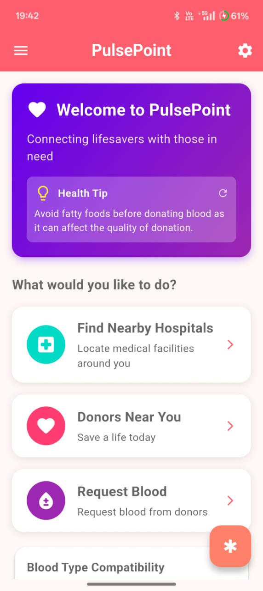 
  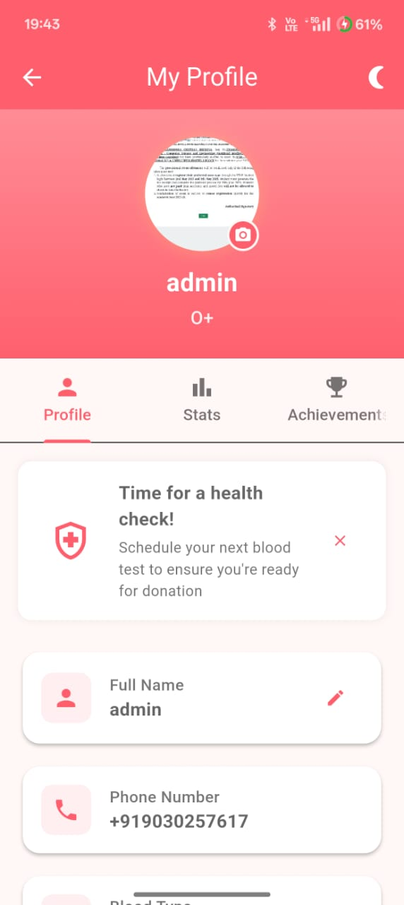
  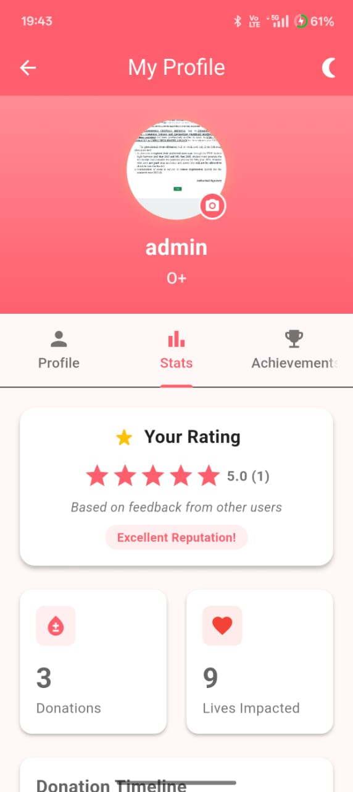
</p>
<p float="left">
  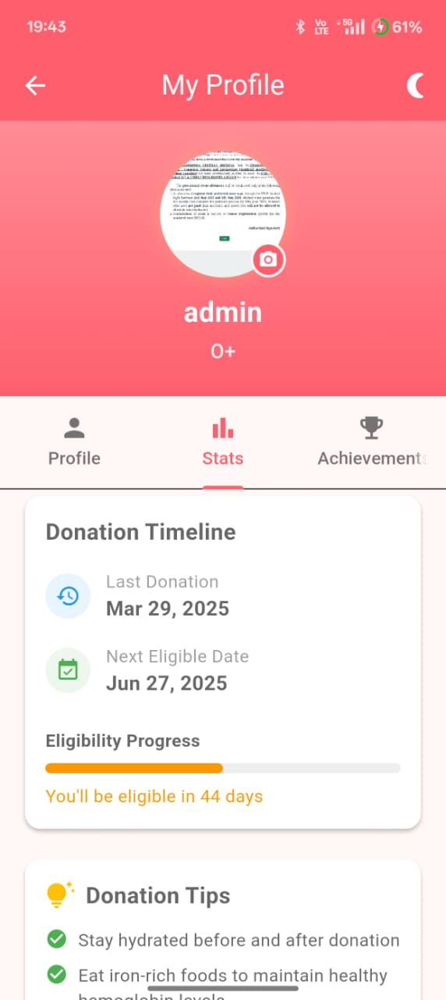
  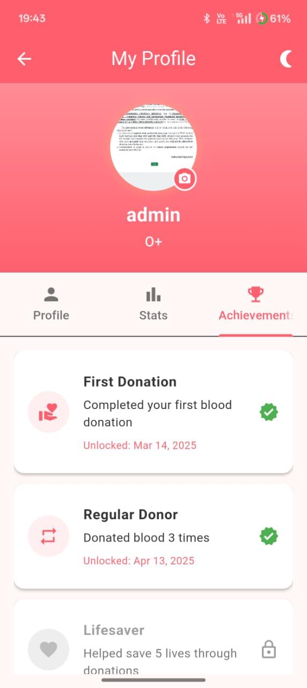
  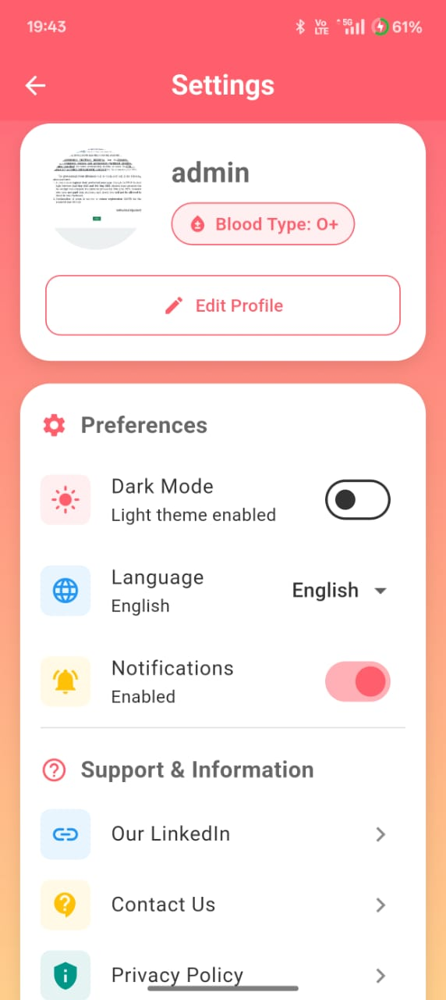
</p>

### Dark Mode
<p float="left">
  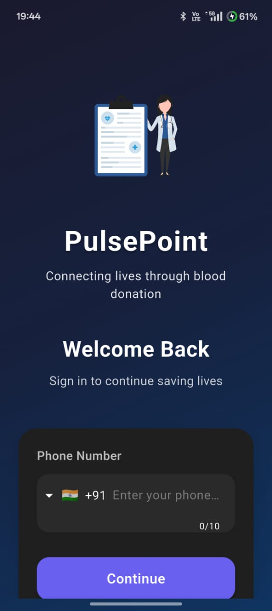
  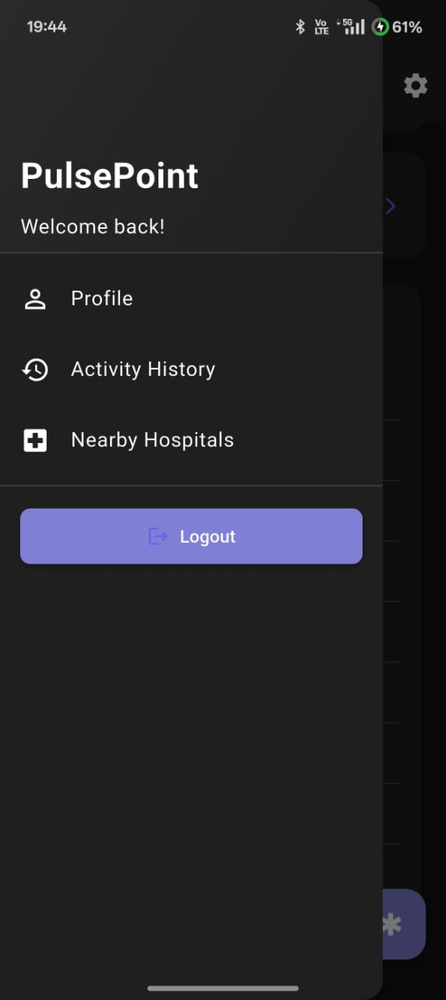 
  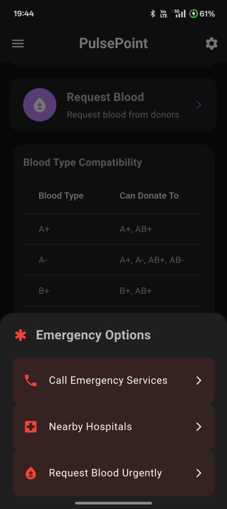
  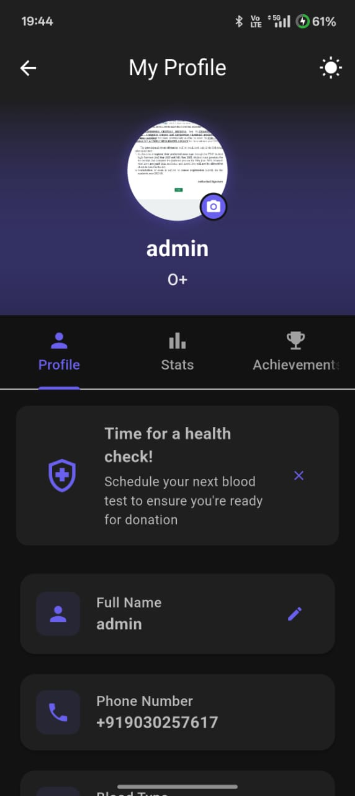
</p>
<p float="left">
  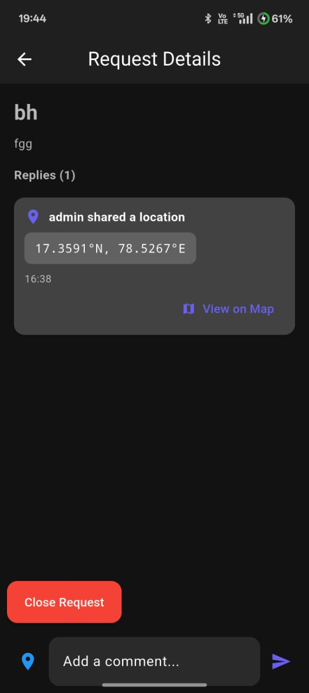
  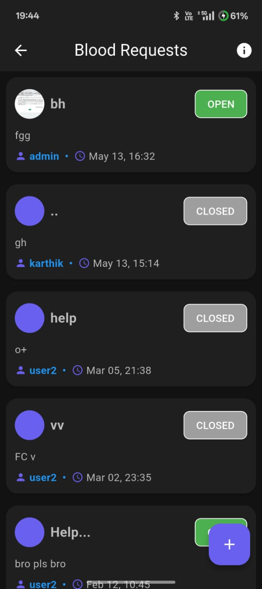
  
  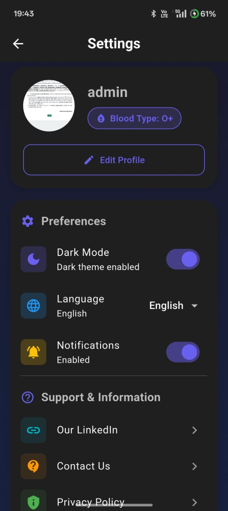
</p>

## Tech Stack

- **Frontend:** Flutter
- **Backend:** Firebase (Authentication, Firestore, Storage, Messaging)
- **State Management:** Provider
- **Notifications:** Firebase Cloud Messaging, Flutter Local Notifications

## Getting Started

### Prerequisites
- Flutter SDK
- Firebase account
- Android Studio / VS Code

### Installation

1. Clone the repository
   ```
   git clone https://github.com/yourusername/pulsepoint.git
   ```

2. Navigate to the project directory
   ```
   cd pulsepoint
   ```

3. Install dependencies
   ```
   flutter pub get
   ```

4. Set up Firebase
   - Create a new Firebase project
   - Add Android and iOS apps to your Firebase project
   - Download and add the configuration files
   - Enable Authentication, Firestore, Storage, and Messaging

5. Run the app
   ```
   flutter run
   ```

## Contributing

Contributions are welcome! Feel free to open issues and submit pull requests to help improve PulsePoint.

1. Fork the repository
2. Create your feature branch (`git checkout -b feature/amazing-feature`)
3. Commit your changes (`git commit -m 'Add some amazing feature'`)
4. Push to the branch (`git push origin feature/amazing-feature`)
5. Open a Pull Request

## License

This project is licensed under the MIT License - see the LICENSE file for details.

## Team

For more information about the development team, check the LinkedIn profiles section in the app.

## Acknowledgments

- Thanks to all contributors who have helped build this app
- Special thanks to the Flutter and Firebase communities for their excellent documentation and support
