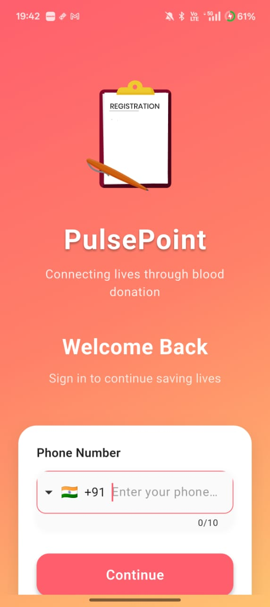
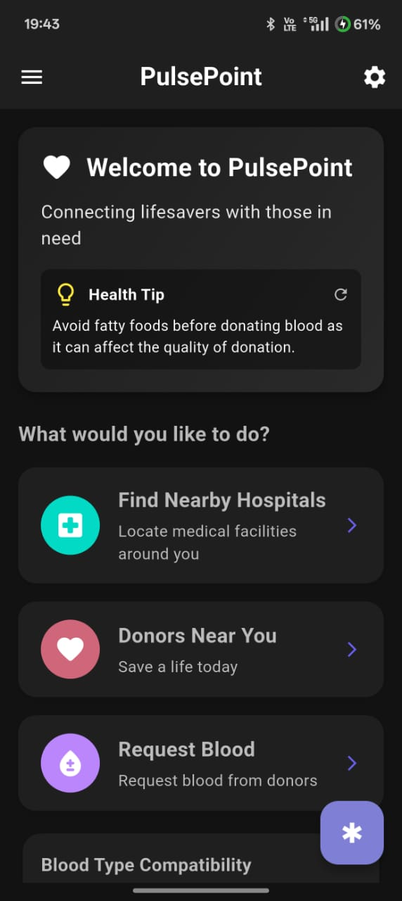

# PulsePoint - Connect Blood Donors & Recipients

PulsePoint is an open-source mobile application built with Flutter that connects blood donors with those in need of blood donations. The app aims to streamline the blood donation process by creating a direct communication channel between donors and recipients.

## Features

- **User Authentication:** Secure phone authentication system
- **Blood Request Management:** Create, browse, and respond to blood donation requests
- **Real-time Messaging:** Direct communication between donors and recipients
- **Location Services:** 
  - Find nearby donation requests and blood donation centers
  - "Find Nearby Hospitals" with integrated map navigation
  - Multiple map app support (Google Maps, Apple Maps, etc.)
- **Health Information:**
  - Blood type compatibility information
  - Health tips and reminders
  - Home screen widget for daily health tips
- **Profile Management:** Manage your blood type, donation history, and personal information
- **Notifications:** Receive alerts for matching blood requests
- **Dark/Light Mode:** Choose your preferred app theme
- **Home Screen Widget:** Daily health tips widget for your device's home screen
- **Customization:** Personalize your experience with various app settings
- **Widget Troubleshooter:** Easily diagnose and fix home screen widget issues

## Screenshots

### Light Mode
<p float="left">
  
   
  
  
</p>
<p float="left">
  
  
  
</p>

### Dark Mode
<p float="left">
  
   
  
  
</p>
<p float="left">
  
  
  
  
</p>

## Tech Stack

- **Frontend:** Flutter
- **Backend:** Firebase (Authentication, Firestore, Storage, Messaging)
- **State Management:** Provider
- **Notifications:** Firebase Cloud Messaging, Flutter Local Notifications
- **Map Integration:** map_launcher, url_launcher
- **Native Integration:** 
  - Method Channels for Flutter-Native communication
  - Android AppWidgetProvider for home screen widgets
  - SharedPreferences for persistent data storage

## Getting Started

### Prerequisites
- Flutter SDK
- Firebase account
- Android Studio / VS Code

### Installation

1. Clone the repository
   ```
   git clone https://github.com/yourusername/pulsepoint.git
   ```

2. Navigate to the project directory
   ```
   cd pulsepoint
   ```

3. Install dependencies
   ```
   flutter pub get
   ```

4. Set up Firebase
   - Create a new Firebase project
   - Add Android and iOS apps to your Firebase project
   - Download and add the configuration files
   - Enable Authentication, Firestore, Storage, and Messaging

5. Run the app
   ```
   flutter run
   ```

## Firebase Phone Authentication Setup

To implement Firebase Phone Authentication with SHA certificates:

1. Generate SHA-1 and SHA-256 keys
   ```
   For Debug:
   keytool -list -v -keystore ~/.android/debug.keystore -alias androiddebugkey -storepass android -keypass android
   
   For Release:
   keytool -list -v -keystore your_keystore_path -alias your_alias
   ```

2. Add SHA keys to Firebase:
   - Go to Firebase Console → Project Settings → Your Android App
   - Scroll down to "SHA certificate fingerprints"
   - Click "Add fingerprint" and add your SHA-1 and SHA-256 keys

3. Enable Phone Authentication in Firebase:
   - Go to Firebase Console → Authentication → Sign-in method
   - Enable "Phone" as a sign-in provider

4. Configure your app:
   - Make sure to add your app's domain to the authorized domains
   - Set up a proper verification method (SMS or reCAPTCHA)
   - Test authentication with test phone numbers in Firebase Console

5. For Android:
   - Make sure your `build.gradle` files are properly configured
   - Add the necessary permissions in `AndroidManifest.xml`

6. For iOS:
   - Configure your `Info.plist` file
   - Set up URL schemes and bundle identifiers

For detailed implementation instructions, refer to the [Firebase Phone Authentication documentation](https://firebase.google.com/docs/auth/flutter/phone-auth).

## Home Screen Widget Setup

PulsePoint includes an Android home screen widget that displays daily health tips. The implementation involves:

1. **Native Android Integration:**
   - The widget is implemented using Android's AppWidgetProvider
   - Communication between Flutter and native code uses MethodChannel
   - Data is stored in SharedPreferences for persistence

2. **Widget Features:**
   - Daily updated health tips
   - Tap functionality to open the app
   - Automatic updates at configurable intervals

3. **Troubleshooting:**
   - The app includes a dedicated Widget Troubleshooter in Settings
   - This tool helps diagnose and fix common widget issues
   - Users can manually refresh widget data and test functionality

4. **Developer Notes:**
   - Widget data is stored redundantly in multiple SharedPreferences locations
   - Comprehensive logging helps identify potential issues
   - The implementation handles various edge cases for improved reliability

## Map Integration

PulsePoint provides map integration to help users locate nearby hospitals and blood donation centers:

1. **Multi-app Support:**
   - Integration with various map applications (Google Maps, Apple Maps, etc.)
   - Uses the map_launcher package to detect and open available map apps
   - Fallback options if preferred map app is unavailable

2. **Features:**
   - "Find Nearby Hospitals" functionality
   - Direction guidance to selected locations
   - Search for blood donation centers in the vicinity

3. **Implementation Details:**
   - Custom URL formatting for different map services
   - Proper AndroidManifest.xml configuration with intent filters
   - Comprehensive error handling with user-friendly fallbacks
   - Support for both address-based and coordinate-based location finding

4. **User Experience:**
   - Seamless transition from app to maps
   - Options to choose preferred map application
   - Clear error messages and alternatives if map launch fails

## Contributing

Contributions are welcome! Feel free to open issues and submit pull requests to help improve PulsePoint.

1. Fork the repository
2. Create your feature branch (`git checkout -b feature/amazing-feature`)
3. Commit your changes (`git commit -m 'Add some amazing feature'`)
4. Push to the branch (`git push origin feature/amazing-feature`)
5. Open a Pull Request

## License

This project is licensed under the MIT License - see the LICENSE file for details.

## Team

For more information about the development team, check the LinkedIn profiles section in the app.

## Acknowledgments

- Thanks to all contributors who have helped build this app
- Special thanks to the Flutter and Firebase communities for their excellent documentation and support
